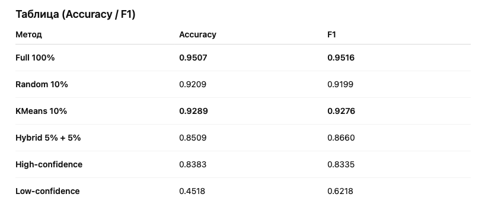

# itmo-edlm-course-project-train-data-sampling

# Отбор Подмножеств Данных для ModernBERT на SST-2  

Исследование влияния различных стратегий отбора 10% данных на итоговое качество модели ModernBERT-base.

---

## 1. Описание проекта

Задача: понять, *какие подмножества обучающих данных оказываются наиболее полезными* при ограниченном бюджете выборки (10% от SST-2).  
Модель: **ModernBERT-base**.  
Датасет: **GLUE SST-2** — бинарная классификация тональности предложений (positive / negative).

**Цель:** сравнить разные стратегии выбора данных и проанализировать разницу в качестве.

---

## 2. Экспериментальная постановка

- **Модель:** `answerdotai/ModernBERT-base`
- **Данные:** GLUE SST-2 (train/validation)
- **Метрики:** Accuracy, F1
- **Объём поднабора:** фиксировано 10% train
- **Базовая верхняя точка:** обучение на 100% данных

Используемые библиотеки:

- PyTorch  
- Transformers / Datasets  
- SentenceTransformers  
- Scikit-learn  
- Evaluate

---

## 3. Стратегии отбора данных

### 3.1 Random 10%  

Случайная выборка без структуры. Контрольный baseline.

### 3.2 High-confidence 10%  

Отбор топ-10% примеров по вероятности истинного класса  
$p_{\text{gold}}(x) = P_\theta(y \mid x)$.

### 3.3 Low-confidence 10%  

Отбор bottom-10% примеров по p_gold — примеры, в которых seed-модель сомневается.

### 3.4 Diversity 10% (KMeans)  

1. Получение эмбеддингов Sentence-BERT (384-d)  
2. Снижение размерности Random Projection → 32-d  
3. KMeans на M=0.1*N кластеров  
4. Выбор ближайшего к центроиду примера — coreset-style выборка

### 3.5 Hybrid 5% random + 5% hard  

1. 5% случайных примеров  
2. Seed-модель обучается  
3. Из оставшихся выбираются bottom-5% по p_gold  
4. Итог — 10%

---

## 4. Структура репозитория

```
.
├── project
│   ├── experiments
│   │   ├── 5random_5hard.ipynb
│   │   ├── baseline_full_train.ipynb
│   │   ├── high_confidence_subset.ipynb
│   │   ├── kmeans_diversity_subset.ipynb
│   │   ├── low_confidence_subset.ipynb
│   │   └── random_subset.ipynb
│   ├── poetry.lock
│   ├── pyproject.toml
│   └── src
│       ├── __pycache__
│       │   ├── data.cpython-311.pyc
│       │   ├── subsets.cpython-311.pyc
│       │   ├── train_utils.cpython-311.pyc
│       │   ├── train.cpython-311.pyc
│       │   ├── utils.cpython-311.pyc
│       │   └── vis.cpython-311.pyc
│       └── train_utils.7py
└── README.md
```

# 5. Менеджер зависимости

Используется Poetry.
Python 3.11.13.

# 6. Результаты



# 7. Анализ

Основные наблюдения

- Diversity (KMeans) → лучший результат среди 10% подмножеств.
- Random → сильный baseline, но уступает diversity.
- High-confidence → переобучение на слишком простых примерах, низкая вариативность.
- Low-confidence → много шума, seed-модель ошибается → качество резко падает.
- Hybrid → улучшает baseline внутри hard-выборки, но уступает diversity.

Краткая интерпретация

- Разнообразие данных критично: покрытие пространства признаков выигрывает у простых/сложных примеров.
- Высокий p_gold → модель избегает сложных примеров → слабая обобщающая способность.
- Низкий p_gold → слишком много ошибок → модель учит шум.

# 8. Вывод

- Diversity-based отбор — оптимальный подход при фиксированном размере поднабора.
- High-confidence выборка не подходит для сокращения данных.
- Low-confidence выборка приводит к сильной деградации качества.
- Random — неплохой baseline, но уступает KMeans.
- Комбинированные методы имеют потенциал, но требуют баланса между hard и coverage.

# 9. Возможные улучшения

- Комбинировать diversity + uncertainty sampling
- Importance sampling на основе loss/entropy
- Submodular approaches (facility location, k-center)
- Multi-stage selection: переоценка и переформирование поднабора

Мне самому кажется, что оптимальнее всего сначала обучиться на KMeans или рандоме, а затем адаптировать active learning в оффлайн формате и это даст хорошее качество.
